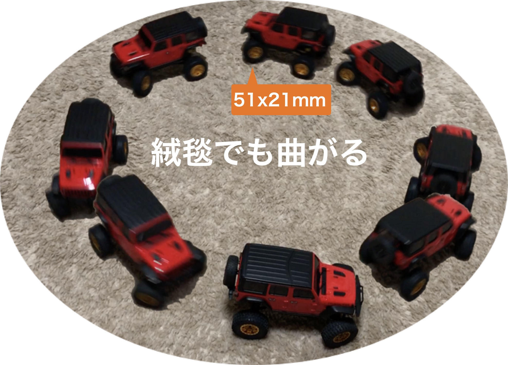
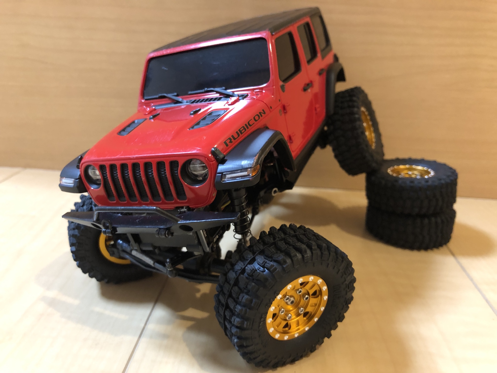
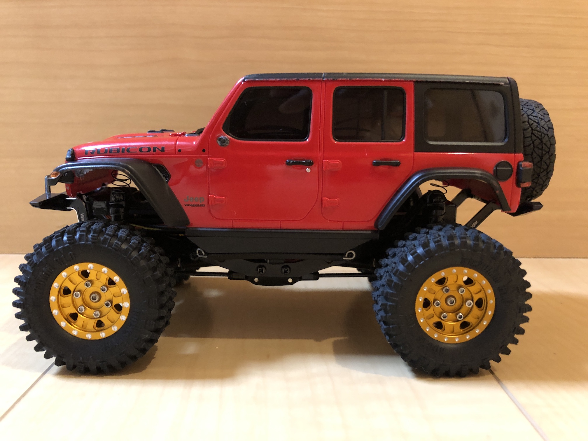

[Home](/blog)

# 大口径タイヤでもよく曲がるミニッツ4x4セッティング



- ミニッツ4x4に大口径、ワイド、ソフトタイヤを取付けると、舵角が著しく悪化します。
- 頭を悩ましている方は少なくないことでしょう。
- 大口径タイヤでも十分な舵角を実現するカスタムを紹介します。



- タイヤは以下の２種類を試しました。

<table>
	<caption>大口径タイヤ</caption>
	<thead><tr><th>タイヤ</th><th>直径・幅</th><th>リフトアップ</th></tr></thead>
	<tr><td>RGT</td><td>46mm・17mm</td><td>ディフェンダー10mm</td></tr>
	<tr><td>Hyrax</td><td>51mm・20mm</td><td>ラングラー15mm</td></tr>
</table>
なお、真鍮アダプタは、6.6mm/2.1gを用いました。

## 外観


- 車体はディフェンダー (D90)で、RGTタイヤを履いています。
- スプリングを取り外していますので、ボディが沈み込んでいます。
- RGTタイヤはノーマルより大きく太い（直径+4mm、幅+3mm）ソフトタイヤです。
- RGTタイヤに交換すると、足回りがノーマルだと舵角が著しく悪くなります。
- 足回りのセッティングを中心に紹介します。


- 車体はラングラーで、Hyraxタイヤを履いています。
- スプリングを無効化していますので、ボディが沈んでいます。
- スプリングを上部1/3をダンパーからはみ出すようにしています。
- こちらのタイヤはRGTタイヤよりも舵角に悪影響をもたらします。

**工事中**
