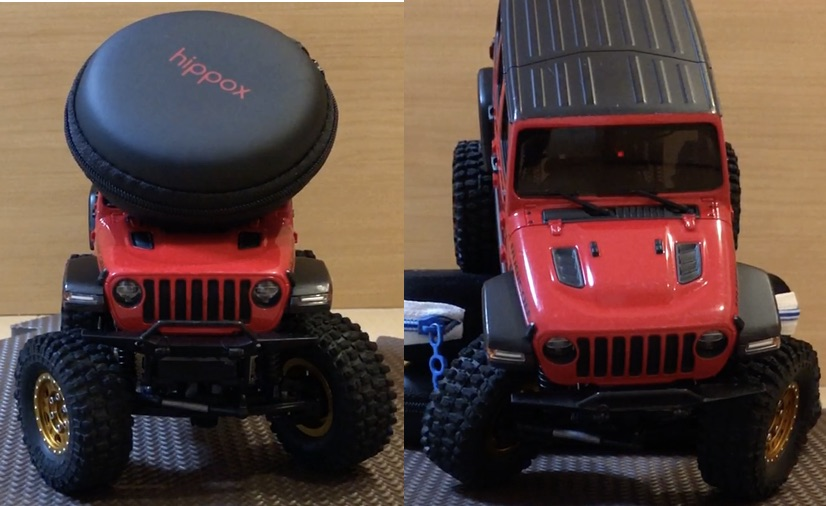
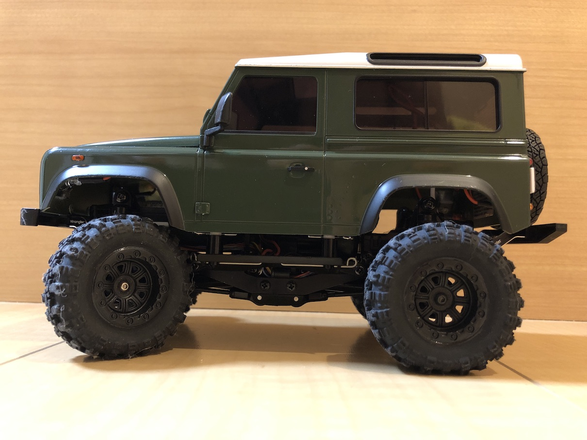
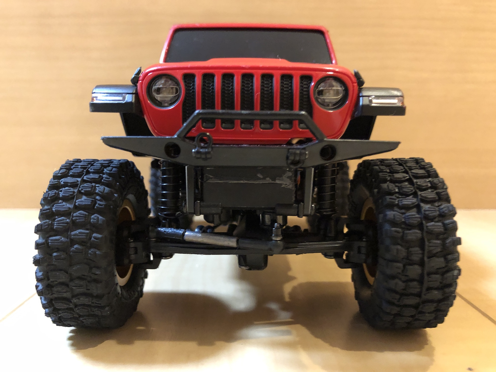



# 大口径タイヤでもよく曲がるミニッツ4x4セッティング

## セッティング概要

- 京商ミニッツ4x4は1/28と小型ですが、スケールクローラーとして生まれ変わる方法を紹介します。



- 前輪に負荷をかけても、よく曲がります。

<iframe width="320" height="180" src="https://www.youtube.com/embed/UNBAk8z3rvc" frameborder="0" allow="accelerometer; autoplay; clipboard-write; encrypted-media; gyroscope; picture-in-picture" loading="lazy" allowfullscreen></iframe>

- フローリング、ジョイントマット、絨毯でも十分な舵角と旋回性能です。

- タイヤは以下の２種類を試しました。

<table>
	<caption>大口径タイヤ</caption>
	<thead><tr><th>直径・幅</th><th>リフトアップ</th><th>備考</th></tr></thead>
	<tr><td>46mm・17mm</td><td>ディフェンダー10mm</td><td>RGTタイヤセット</td></tr>
	<tr><td>51mm・20mm</td><td>ラングラー15mm</td><td>Hyraxパターン</td></tr>
</table>
なお、真鍮アダプタは、6.6mm/2.1g（ラングラー）、5mm/1.2g（ディフェンダー ）を用いました。

## 外観


- 車体はディフェンダー (D90)で、RGTタイヤを履いています。
- スプリングを取り外していますので、ボディが沈み込んでいます。
- RGTタイヤはノーマルより大きく太い（直径+4mm、幅+3mm）ソフトタイヤで路面に食いつきます。
- 箱出しでタイヤだけRGTタイヤセットのものに交換すると、舵角が著しく悪くなります。


- 車体はラングラーで、51mmのHyraxパターンのタイヤを履いています。
- スプリングを無効化していますので、ボディが沈んでいます。


- サーボホーンはアルミ製のハイトルク仕様に変更しています。
- タイロッドは箱出しでは斜めになっていますが、ほぼ水平になっています。
- サーボの力がよく伝わり、舵角が改善します。
- また、ガタ対策で若干ではありますが、舵角改善が期待できます。

**改造は自己責任で**

[次のセッティングへ](/steering_settings/servo_horn)

[セッティングTopに戻る](/steering_settings)
