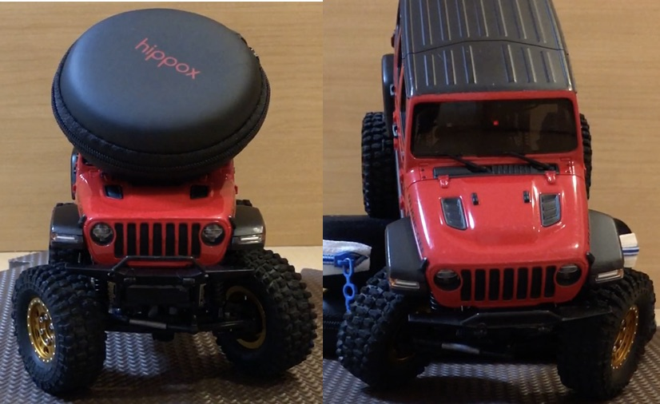
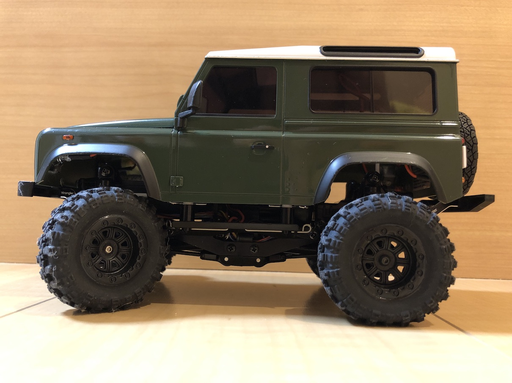
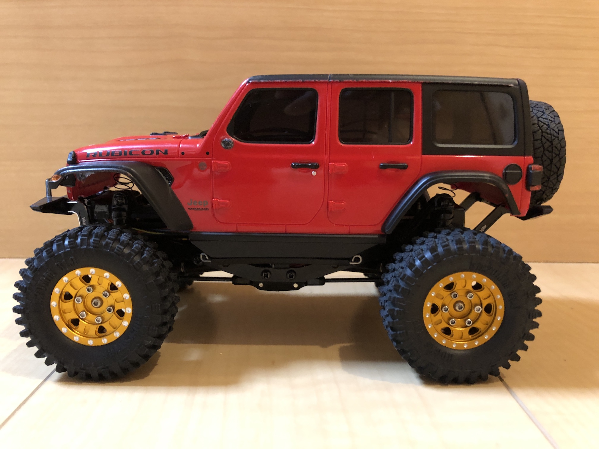
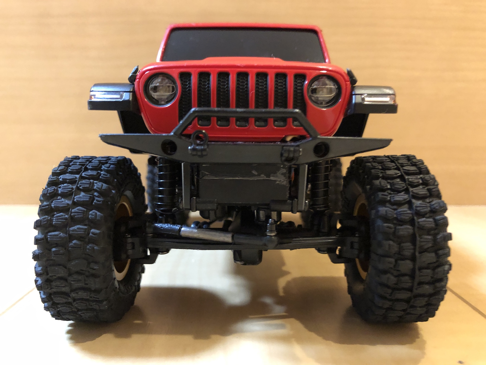



# 大口径タイヤでもよく曲がるミニッツ4x4セッティング



## セッティング概要

- 京商ミニッツ4x4は1/28と小型ですが、スケールクローラーとして生まれ変わる方法を紹介します。
- こんなこともできてしまう、潜在能力を秘めたRCで、遊びの幅は一挙に広がります。

<iframe width="560" height="315" src="https://www.youtube.com/embed/1Qy859OU9rA" frameborder="0" allow="accelerometer; autoplay; clipboard-write; encrypted-media; gyroscope; picture-in-picture" loading="lazy" allowfullscreen></iframe>

- ミニッツ4x4のボディは小ぶりながらもディテールが作り込まれており、海外でも定評があります。
- しかし、ボディが重たいため重心が高くなることがデメリットでもあります。
- ノーマルタイヤは小径で細く、悪路をトレイルしたり岩場を攻めるには不向きです。
- ***タイヤを大きくしつつ、重心を下げる工夫が必要です。***
- さらに、ミニッツ4x4は、ノーマルよりも大きくて太いタイヤを装着すると、舵角が著しく悪くなります。
- これらの問題を解決する方法を紹介します。





- 前輪に負荷をかけても、よく曲がります。

- タイヤは以下の２種類を試しました。

<table>
	<caption>大口径タイヤ</caption>
	<thead><tr><th>タイヤ</th><th>直径・幅</th><th>リフトアップ</th></tr></thead>
	<tr><td>RGT</td><td>46mm・17mm</td><td>ディフェンダー10mm</td></tr>
	<tr><td>Hyrax</td><td>51mm・20mm</td><td>ラングラー15mm</td></tr>
</table>
なお、真鍮アダプタは、6.6mm/2.1gを用いました。

## 外観


- 車体はディフェンダー (D90)で、RGTタイヤを履いています。
- スプリングを取り外していますので、ボディが沈み込んでいます。
- RGTタイヤはノーマルより大きく太い（直径+4mm、幅+3mm）ソフトタイヤです。
- RGTタイヤに交換すると、足回りがノーマルだと舵角が著しく悪くなります。
- 足回りのセッティングを中心に紹介します。


- 車体はラングラーで、Hyraxタイヤを履いています。
- スプリングを無効化していますので、ボディが沈んでいます。


- タイロッドは箱出しでは斜めになっていますが、ほぼ水平になっています。
- サーボの力がよく伝わり、舵角が改善します。
- また、ガタ対策で若干ではありますが、舵角改善が期待できます。

**工事中**
