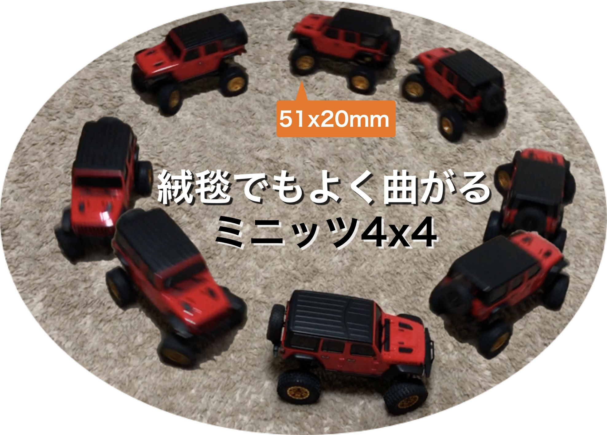
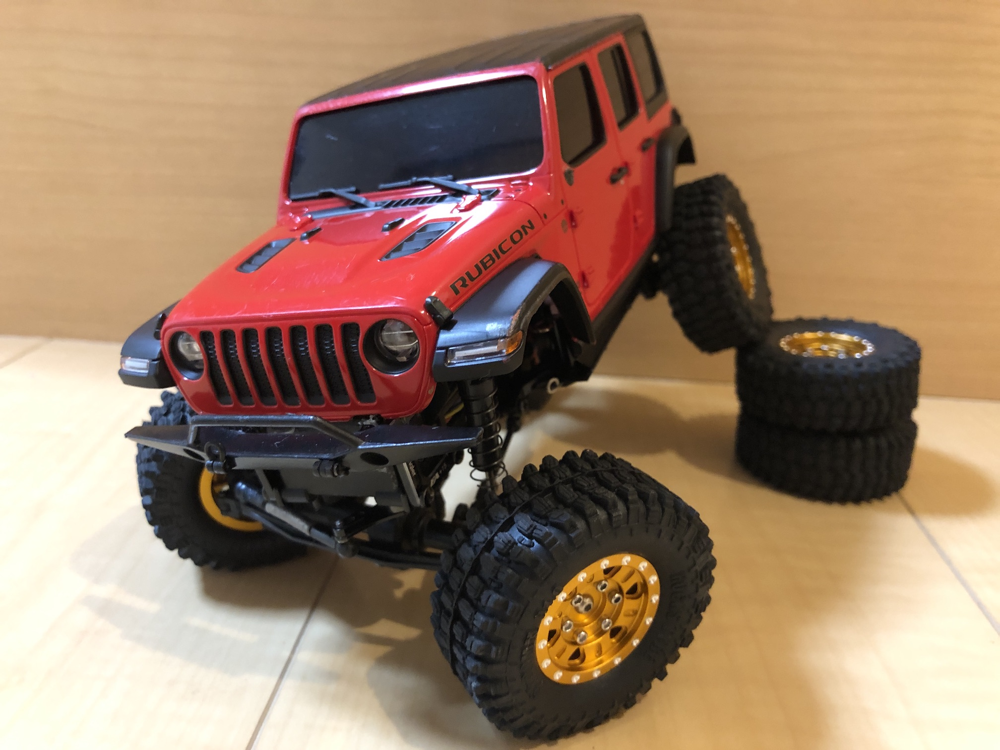



# 大口径タイヤでもよく曲がるミニッツ4x4セッティング



## セッティングの目的と背景

- 京商ミニッツ4x4は1/28と小型ですが、スケールクローラーとして生まれ変わる方法を紹介します。

<iframe width="560" height="315" src="https://www.youtube.com/embed/GXepZuPh_8w" frameborder="0" allow="accelerometer; autoplay; clipboard-write; encrypted-media; gyroscope; picture-in-picture" loading="lazy" allowfullscreen></iframe>
- こんなこともできてしまう、潜在能力を秘めたRCで、遊びの幅は一挙に広がります。

- ミニッツ4x4のボディは小ぶりながらもディテールが作り込まれており、海外でも定評があります。
- しかし、ボディが重たいため重心が高いことがデメリットでもあります。
- ノーマルタイヤは小径で細く、悪路をトレイルしたり岩場を攻めるには不向きで、重心が高いためすぐに転んでしまいます。
- ***タイヤを大きくしつつ、重心を下げる工夫が必要です。***

- では、ウェイトカスタマイズで低重心化して、大口径のタイヤを装着すれば、走破性が向上するのでしょうか？
- ***ミニッツ4x4にはここに大きな落とし穴があります。***
- ノーマルよりも大きくて太いタイヤを装着すると、舵角が著しく悪くなり、曲がりが極端に悪くなります。
- これらの問題を解決する方法を紹介します。



## 目次
- [セッティング概要](/blog/steering_settings/abstract)
- [その1 パーツ追加 アルミ製ハイトルクサーボホーン](/blog/steering_settings/servo_horn)
- [その2 スプリング無効化](/blog/steering_settings/spring_invalidation)
- [その3 その他の調整 各種ガタ対策](/blog/steering_settings/others)
- [補足 追加パーツのリスト](/blog/steering_settings/additional_parts)

**改造は自己責任で**

[セッティング概要を読む](/blog/steering_settings/abstract)

[ホーム](/blog)
